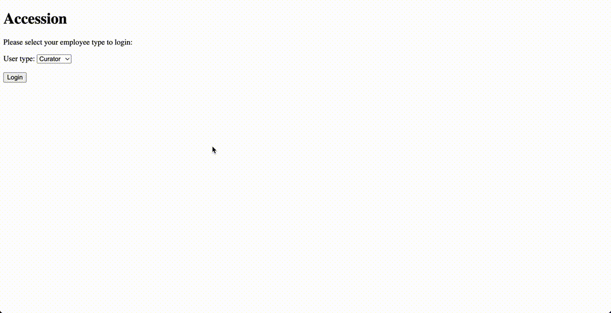

## Accession
### A Museum Management Application

This application allows museum employees to manage articles, collections, and exhibits.

Archivists can search and update articles and record article examination details.

Curators can search articles, exhibits and associated activities, and collections. They can plan exhibits by finding articles currently on display, adding or removing articles from exhibits, and view visitor and revenue information from exhibits. As well, they can manage collections by adding and removing articles from collections.

### Museum Application Demo

### ER Diagram

#### References

1. CSS sidebar: https://www.w3schools.com/howto/howto_css_sidebar_responsive.asp